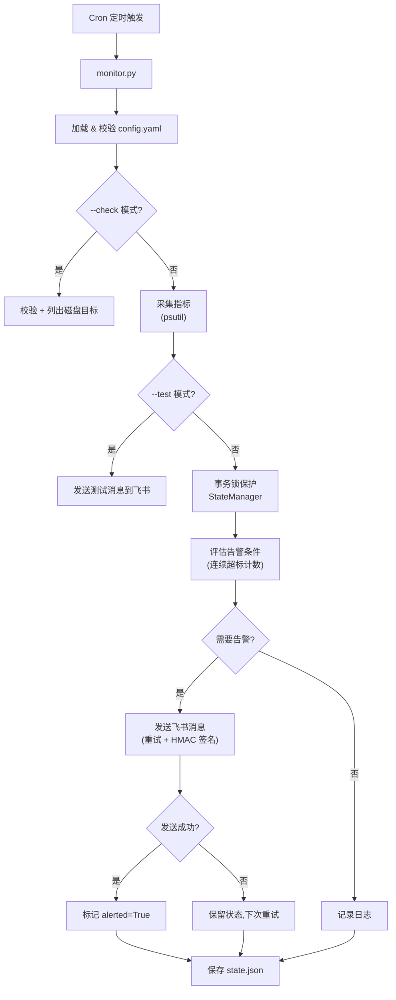

# srvpulse

> 轻量级服务器资源监控告警工具 — 定时采集 CPU / 内存 / 磁盘使用率，连续超标后通过飞书机器人发送告警。

[](https://www.python.org/)
[](https://kernel.org/)
[](LICENSE)

**srvpulse**（Server Pulse）是一个单文件 Python 监控脚本，配合 Cron 定时运行，无需额外服务。适合开发服务器、测试环境等场景的轻量资源告警。

---

## 功能特性

| 特性 | 说明 |
|------|------|
| **多指标监控** | CPU / 内存 / 磁盘，每个指标独立阈值 |
| **磁盘自动发现** | 自动扫描真实硬盘挂载，排除 Docker overlay 等虚挂载（常显示 100%） |
| **防抖动告警** | 连续超标 N 次才触发，避免瞬时波动误报 |
| **可靠送达** | 飞书 API 返回成功才标记已告警；失败自动重试 |
| **事务级状态** | 跨平台文件锁保护状态读写（Linux / Windows） |
| **严格校验** | 启动时完整校验配置；`--check` 可预览磁盘监控目标 |
| **一键部署** | `deploy.sh` 自动安装依赖、配置 Cron、设置 logrotate |
| **Python 兼容** | 支持 Python 3.6 - 3.13+ |

---

## 系统架构



---

## 快速开始

### 1. 克隆项目

```bash
git clone git@github.com:gejigang2008/srvpulse.git
cd srvpulse
```

### 2. 配置飞书机器人（一次性）

1. 在飞书目标群聊中添加「**自定义机器人**」
2. 开启「**签名校验**」，复制密钥和 Webhook 地址

### 3. 创建配置文件

```bash
cp config.yaml.example config.yaml
vim config.yaml   # 填入 feishu.webhook_url 和 feishu.secret
```

### 4. 本地验证

```bash
pip install -r requirements.txt

python monitor.py --check   # 校验配置，列出磁盘监控目标
python monitor.py --test    # 测试飞书连通性
python monitor.py           # 手动执行一次监控
```

### 5. 部署到 Linux 服务器

```bash
scp -r srvpulse/ user@server:/tmp/
ssh user@server
cd /tmp/srvpulse
sudo ./deploy.sh
```

部署后安装路径：`/opt/monitor/`（脚本名保持 `monitor.py` 不变）

```bash
sudo /opt/monitor/venv/bin/python /opt/monitor/monitor.py --test
tail -f /var/log/monitor.log
```

---

## 配置说明

```yaml
log_level: INFO
consecutive_count: 3          # 连续超标多少次触发告警

monitors:
  cpu:
    enabled: true
    threshold: 90

  memory:
    enabled: true
    threshold: 85

  disk:
    enabled: true
    auto_discover: true       # 自动发现真实磁盘挂载
    default_threshold: 90
    paths: []                 # 可选：手动补充，如 /data 单独设阈值
      # - path: /data
      #   threshold: 85

feishu:
  webhook_url: "https://open.feishu.cn/open-apis/bot/v2/hook/..."
  secret: "YOUR_SECRET_KEY"
  timeout: 5
  max_retries: 3
```

**磁盘监控说明：**

- `auto_discover: true` 自动扫描 `ext4`/`xfs`/`ntfs` 等真实分区
- 默认排除 `overlay`、`tmpfs` 及 `/var/lib/docker` 等 Docker 虚挂载
- 每个挂载点**独立阈值、独立告警**，互不影响

完整方案见 [开发服务器资源监控告警系统 — 完整方案.md](./开发服务器资源监控告警系统%20—%20完整方案.md)

---

## 命令行用法

| 命令 | 说明 |
|------|------|
| `python monitor.py` | 正常执行监控采集与告警 |
| `python monitor.py --check` | 校验配置，并列出磁盘监控目标 |
| `python monitor.py --test` | 发送测试消息到飞书 |

---

## 项目结构

```
srvpulse/
├── monitor.py              # 主监控脚本
├── config.yaml.example     # 配置模板
├── requirements.txt        # Python 依赖
├── deploy.sh               # 一键部署（Linux）
├── uninstall.sh            # 卸载脚本（Linux）
├── README.md
└── 开发服务器资源监控告警系统 — 完整方案.md
```

---

## 环境要求

| 项目 | 要求 |
|------|------|
| 操作系统 | Linux（生产部署）/ Windows（开发调试） |
| Python | 3.6 - 3.13+（推荐 3.8+） |
| 网络 | 可访问 `open.feishu.cn` |
| 权限 | Linux 部署需 root |

---

## 设计要点

- **发送成功才标记已告警** — 网络故障时不丢告警、下次 Cron 重试
- **事务级文件锁 + 原地写入** — 避免并发损坏 `state.json`
- **跨平台** — Linux `fcntl.flock` / Windows `msvcrt.locking`

---

## License

MIT

---

*srvpulse v1.1 | 单机轻量部署 | [GitHub](https://github.com/gejigang2008/srvpulse)*
